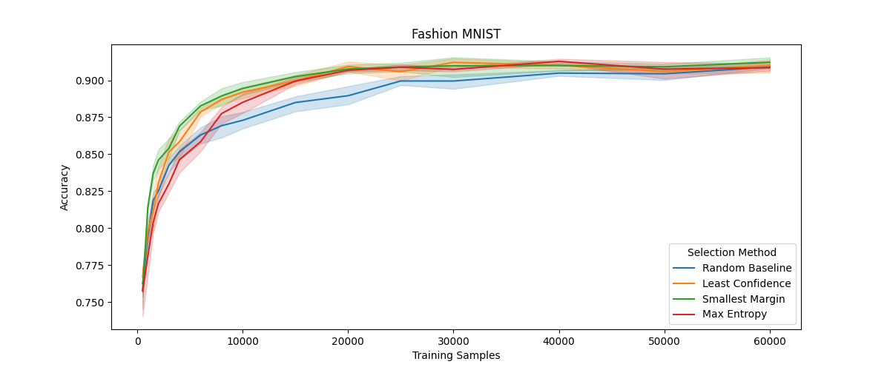

# Active Learning Lab

This experiment is a simple simulation of different active learning methods to demonstrate their performance using the MNIST dataset.

Starting with a small random sample of 5000 labeled images, I trained a CNN model and used it to select the next samples with the following strategies:

- *Least Confidence*: Selecting samples where the highest softmax output had the lowest values.
- *Smallest Margin*: Selecting the samples with the lowest margin between the first and second highest softmax outputs.
- *Maximum Entropy*: Selecting the samples with the highest entropy in softmax outputs.

A control group was included which selects samples randomly from the remaining pool, and each group was tested 5 times.
For each iteration a new CNN is trained from scratch on the dataset with the newly added samples.
